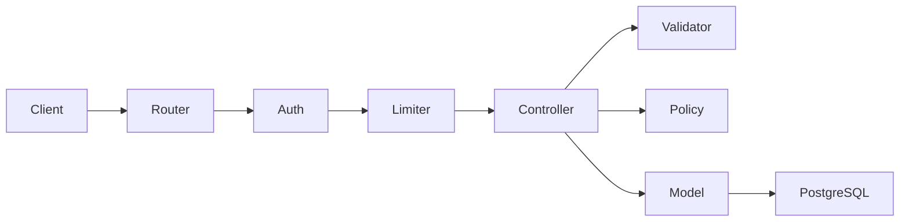

# Adonis Production Starter


Production-ready REST API starter built with AdonisJS, PostgreSQL and
TypeScript.

The goal of this project is to provide a clean backend foundation with
authentication, authorization, validation, testing, Docker support and
automated CI.

## Features

-   AdonisJS 7
-   TypeScript
-   PostgreSQL
-   Lucid ORM
-   Access token authentication
-   RBAC with Bouncer policies
-   Request validation with VineJS
-   Project ownership protection
-   Rate limiting
-   OpenAPI 3.1 specification
-   Scalar API documentation
-   Functional tests
-   Docker production setup
-   PostgreSQL health checks
-   GitHub Actions CI
-   Application health endpoint

## Tech stack

  Category        Technology
  --------------- -------------------------
  Framework       AdonisJS
  Language        TypeScript
  Runtime         Node.js 24
  Database        PostgreSQL
  ORM             Lucid
  Validation      VineJS
  Authorization   AdonisJS Bouncer
  Testing         Japa
  Containers      Docker / Docker Compose
  CI              GitHub Actions
  API Docs        OpenAPI 3.1 + Scalar

## Architecture



The application follows a simple layered approach:

-   **Routes** define the HTTP interface.
-   **Middleware** handles authentication and rate limiting.
-   **Validators** validate external input.
-   **Policies** handle resource authorization.
-   **Controllers** coordinate HTTP requests.
-   **Lucid models** handle persistence.

## Getting started

### Requirements

-   Node.js 24+
-   npm
-   Docker

### Installation

``` bash
git clone https://github.com/OthmanOff/adonis-production-starter.git
cd adonis-production-starter
npm install
```

Create your environment file:

``` bash
cp .env.example .env
```

On Windows PowerShell:

``` powershell
Copy-Item .env.example .env
```

Generate an application key:

``` bash
node ace generate:key
```

## Database

Start PostgreSQL:

``` bash
docker compose up -d postgres
```

Run migrations:

``` bash
node ace migration:run
```

## Development

``` bash
npm run dev
```

The API will be available at `http://localhost:3333`.

## Docker

Build and start the complete application:

``` bash
docker compose up -d --build
```

Run migrations inside the API container:

``` bash
docker compose exec api node ace migration:run --force
```

Check container status:

``` bash
docker compose ps
```

## Health check

``` http
GET /health
```

Example response:

``` json
{
  "status": "ok",
  "timestamp": "2026-09-07T10:00:00.000Z"
}
```

## API documentation

Interactive API documentation is available at `/docs`.

The raw OpenAPI specification is available at `/openapi.json`.

## Projects API

All project routes require authentication.

  Method   Endpoint                 Description
  -------- ------------------------ --------------------------
  GET      `/api/v1/projects`       List accessible projects
  POST     `/api/v1/projects`       Create a project
  GET      `/api/v1/projects/:id`   Get one project
  PATCH    `/api/v1/projects/:id`   Update a project
  DELETE   `/api/v1/projects/:id`   Delete a project

### Example payload

``` json
{
  "name": "Example project",
  "description": "My project",
  "status": "active"
}
```

Available statuses are `active`, `completed`, and `archived`.

## Authorization

Users can only access projects they own.

Unauthorized access to another user's resource returns `404 Not Found`
instead of exposing the existence of the resource.

Administrators can access resources through Bouncer policy overrides.

## Rate limiting

-   Authenticated users: **100 requests/minute**
-   Unauthenticated users: **20 requests/minute**

Rate-limit violations return `429 Too Many Requests`.

## Testing

Run the functional test suite:

``` bash
node ace test
```

Run TypeScript checks:

``` bash
npm run typecheck
```

The project includes tests for:

-   unauthenticated access
-   project creation
-   validation
-   project ownership
-   unauthorized resource access
-   project updates
-   project deletion
-   administrator access

## Continuous integration

GitHub Actions automatically runs on pushes and pull requests to `main`.

The CI pipeline:

1.  Starts PostgreSQL
2.  Installs dependencies
3.  Runs database migrations
4.  Runs TypeScript type checking
5.  Runs the test suite

## Production

The Docker image uses a multi-stage build with production dependencies
only and runs the application as a non-root user.

PostgreSQL uses a persistent volume and health check. Application
secrets are injected at runtime and are not included in the Docker
image.

## Security

This starter includes:

-   Access-token authentication
-   Resource-level authorization
-   RBAC
-   Request validation
-   Rate limiting
-   Environment validation
-   Non-root Docker execution
-   Hidden resource existence for unauthorized users

## License

MIT
